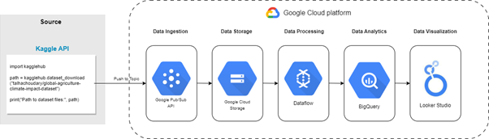

# SQL and Google BigQuery Projects
This project develops an end-to-end data pipeline on Google Cloud Platform (GCP) to analyze how rising global temperatures and extreme weather events affect agricultural productivity across the dataset.

## Project Title: Comprehensive Agricultural & Climate Trend Analysis
This repository documents a SQL and Google BigQuery project focused on analyzing the relationship between climate variables and global agricultural productivity. This project demonstrates the ability to process large environmental datasets, aggregate yearly performance data across different climate zones and crop types, with the help of data visualtion in data studio and generate actionable insights. 

## Dataset
- **Source:** Kaggle (Global Agriculture Climate Impact Dataset)
- **File:** `dataset.csv`
- **Size:** 10,000 rows of global agricultural and climatic data
- **Features:** Year, Country, Region, Crop Type, Average Temperature, Total Precipitation, CO2 Emissions, Crop Yield (MT per HA), Extreme Weather Events, and Soil Health Index 

## Technical Architecture 
- Data Ingestion: Automated via Kaggle API and decoupled using **Google Cloud Pub/Sub** messaging

- Data Storage: Raw data is stored in **Google Cloud Storage (GCS)** for consistency and durability

- Data Processing:**Google Dataflow** handles cleaning and type formatting 

- Data Analytics: **Google BigQuery** serves as the primary "big SQL database" for complex transformations, analytics, and large-scale dataset management.

[View BigQuery SQL as download file](https://github.com/SpencerLimSzeSing/SQL-GoogleBigQuery-Projects/blob/main/SQL%20script.sql)

- Data Visualization: **Looker Studio** provides the final "storytelling" layer for creating interactive dashboards and visualizing the interplay between climate and yield.

[View Project on Looker Studio](https://datastudio.google.com/s/pdKTIuOlge0)

  
  
<i>Figure 1: The end-to-end GCP architecture, from Kaggle API ingestion to Looker Studio visualization.</i>

## Data Insights & Outcomes 
- The analysis successfully identified several critical relationships between climate variables and food security

- Climate Vulnerability: Tropical regions (e.g., Nigeria) show declining yields due to extreme weather, while temperate regions (e.g., USA) remain stable through technological adaptation

- Crop Resilience: Cereals and grains show high stability, whereas cash crops (coffee, sugarcane) exhibit high volatility due to environmental sensitivity

- Environmental Correlation: Identified a slight positive correlation between CO2 emissions and average temperature, with rice and cotton identified as the highest-emitting crops

  
  
<i>Figure 2 - Geographic Trend</i>

  
  
<i>Figure  3 - Yearly Trendby Climate Metrics</i>

  
  
<i>Figure 2 - Geographic Trend</i>

## Skills Demonstrated:
### SQL Querying & Cloud Architecture
- Advanced Analytics: Leveraged Window Functions (MIN/MAX OVER) and aggregations (SUM, AVG) to normalize climate data across 10k+ records.
- Data Modeling: Engineered specialized analytical tables (geographic_metrics) to optimize BigQuery performance for downstream BI tools.
- Query Optimization: Structured queries for sub-second execution in BigQuery, minimizing compute costs and latency.
- End-to-End Pipelines: Architected a seamless flow from GCS and Dataflow into BigQuery.

### Analytical Skills
- Correlation Analysis: Identified key relationships between CO2 emissions, temperature spikes, and crop yield volatility.
- Geographic Intelligence: Derived regional climate-risk profiles for tropical vs. temperate agriculture (e.g., Nigeria vs. USA).
