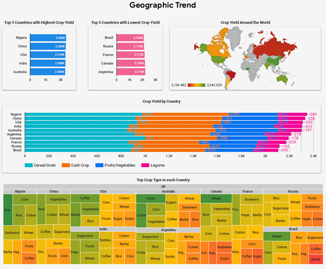
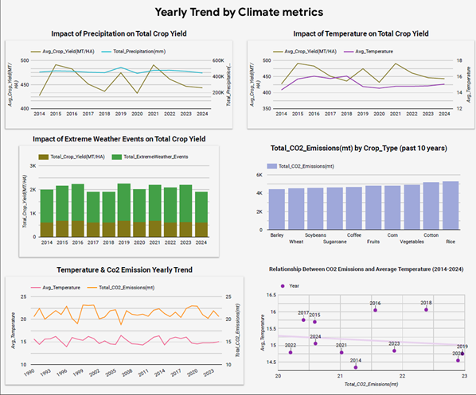
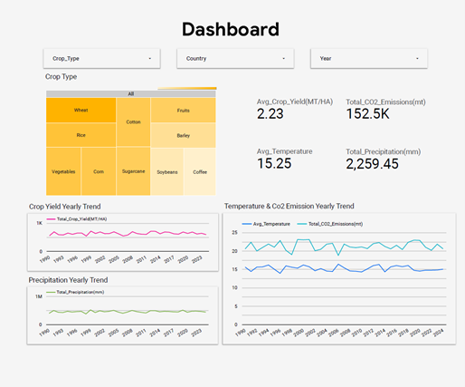

# SQL and Google BigQuery Projects
This project develops an end-to-end data pipeline on Google Cloud Platform (GCP) to analyze how rising global temperatures and extreme weather events affect agricultural productivity across the dataset.

## Project Title: Comprehensive Agricultural & Climate Trend Analysis
This repository documents a SQL and Google BigQuery project focused on analyzing the relationship between climate variables and global agricultural productivity. This project demonstrates the ability to process large environmental datasets, aggregate yearly performance data across different climate zones and crop types, with the help of data visualtion in data studio and generate actionable insights to address global food security challenges. 

## Dataset
- **Source:** Kaggle (Global Agriculture Climate Impact Dataset)
- **File:** `dataset.csv`
- **Size:** 10,000 rows of global agricultural and climatic data
- **Features:** Year, Country, Region, Crop Type, Average Temperature, Total Precipitation, CO2 Emissions, Crop Yield (MT per HA), Extreme Weather Events, and Soil Health Index 

## Technical Architecture 
- Data Ingestion: Automated via Kaggle API and decoupled using **Google Cloud Pub/Sub** messaging

- Data Storage: Raw data is stored in **Google Cloud Storage (GCS)** for consistency and durability

- Data Processing:**Google Dataflow** handles cleaning and type formatting 

- Data Analytics: **Google BigQuery** serves as the primary "big SQL database" for complex transformations, analytics, and large-scale dataset management.
[View BigQuery SQL as download file](https://github.com/SpencerLimSzeSing/SQL-GoogleBigQuery-Projects/blob/main/SQL%20script.sql)

- Data Visualization: **Looker Studio** provides the final "storytelling" layer for creating interactive dashboards and visualizing the interplay between climate and yield.
[View Project on Looker Studio](https://datastudio.google.com/s/pdKTIuOlge0)

*Figure 1: The end-to-end GCP architecture, from Kaggle API ingestion to Looker Studio visualization.*

## Data Insights & Outcomes 
- The analysis successfully identified several critical relationships between climate variables and food security

- Climate Vulnerability: Tropical regions (e.g., Nigeria) show declining yields due to extreme weather, while temperate regions (e.g., USA) remain stable through technological adaptation

- Crop Resilience: Cereals and grains show high stability, whereas cash crops (coffee, sugarcane) exhibit high volatility due to environmental sensitivity

- Environmental Correlation: Identified a slight positive correlation between CO2 emissions and average temperature, with rice and cotton identified as the highest-emitting crops

  
  
  

### Skills Demonstrated:
### SQL Querying and Data Management

- Data Aggregation: Expertise in using SQL functions like AVG and SUM to derive trends from 10,000 records, grouped by year, country, and crop type.
- Advanced Window Functions: Proficiency in using Window Functions (MIN/MAX OVER()) to calculate normalized values for precipitation and temperature, enabling objective comparison of climate impacts.
- Data Transformation: Ability to create specialized analytical tables such as comprehensive_trends and geographic_metrics to optimize datasets for BI reporting.
- Query Optimization: Demonstrated ability to structure queries that BigQuery can process in under one second, ensuring high performance even during complex aggregations

### Google BigQuery & Cloud Architecture

- Pipeline Integration: Experience integrating BigQuery with GCS and Dataflow to create a seamless end-to-end data pipeline.
- Performance Evaluation: Competence in analyzing query execution details, including monitoring slot time, bytes processed, and stage-specific durations (Input, Aggregate, Output).
- Scalability Testing: Ability to assess the platform’s capacity to handle growing data volumes while maintaining responsive dashboard rendering.

### Analytical Skills
- Correlation Analysis: Experience in identifying relationships between variables, such as the positive correlation between CO2 emissions and temperature, and the negative impact of extreme weather on yields.
- Geographic Insights: Ability to derive specialized regional insights, such as identifying how specific countries (e.g., Nigeria, USA) specialize in crops based on their unique climate profiles.
- Insight Generation: Translating complex data into strategic findings, such as recognizing the stability of cereal yields compared to the volatility of cash crops under changing climate conditions.
